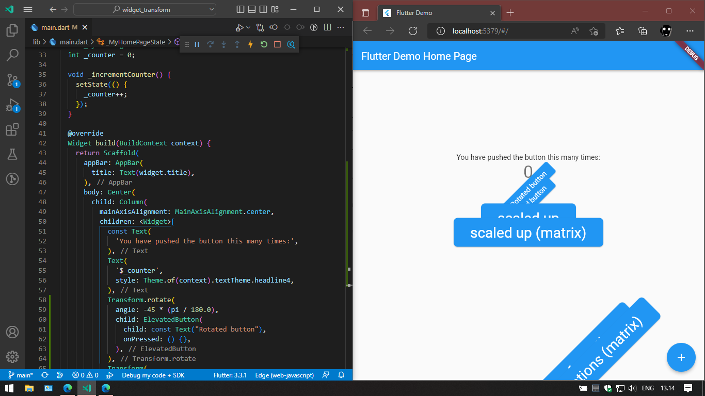

# widget_transform

Mengkustomisasi widget dan animasi.

## Hasil

### Transform

Menggunakan widget transform untuk mengubah scale, offset, translation.

### Perspective

Menambahkan parameter setentry untuk merubah prespective.
